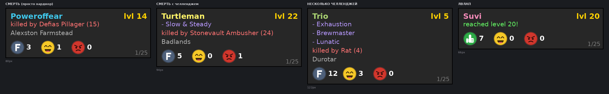
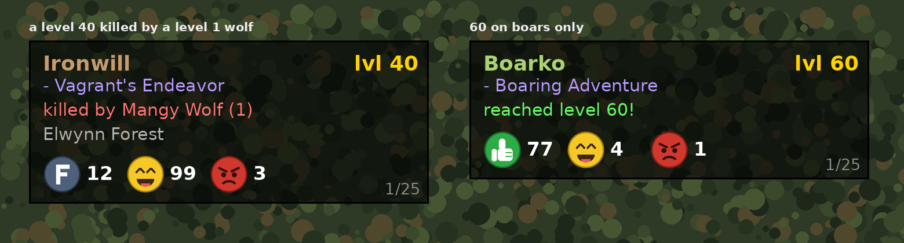

# OctoFeed

A death and level-up feed under the minimap for vanilla 1.12-based realms that announce
player deaths and level-ups over the system channel.

When the server announces that someone died, dinged, or went immortal, a card appears
under your minimap with the name in class colour, the level, the challenge, what killed
them and where — plus three reaction buttons that post to the World channel and count how
many other people reacted in chat.



Card states, left to right: a plain hardcore death, a death with a challenge, several
challenges at once, and a level-up. Height follows the content — empty rows collapse.



The counters are other players, not your clicks.

## Install

Copy the folder into `Interface\AddOns\OctoFeed` so that it contains
`OctoFeed.toc`, `OctoFeed.lua` and the four `.tga` icons.

Then type `/octo demo` in game — it fakes a few events so you can see and click the card
without waiting for someone to die.

## Reactions

The first button follows the event:

| Event | Button 1 | Button 2 | Button 3 |
|---|---|---|---|
| Death | `F <name>` | `LOL <name>` | `FK <name>` |
| Level-up | `GZ <name>` | `LOL <name>` | `FK <name>` |
| Immortal | `GZ <name>` | `LOL <name>` | `FK <name>` |

The number next to a button counts **other players**, not your clicks. Chat is matched
per event kind, so a bare `f` on a death is respect while `fk` is rage. A bare reaction
with no name attaches to the newest event (people rarely type the name); one sender is
counted once per event and kind.

Every 5th message you send is tagged ` (OctoFeed)`. Change it with `/octo ad 10`, turn it
off with `/octo ad 0`.

## Commands

```
/octo demo          fake events, to see and click the card
/octo show | hide   force the card
/octo pos           put it back under the minimap
/octo width 230     card width (150-500)
/octo alpha 0.6     background opacity
/octo duration 60   seconds the card stays up
/octo channel World where reactions are posted
/octo ad 5          tag 1 message in N with the addon name (0 = off)
/octo deaths        toggle deaths
/octo levels        toggle level-ups and immortal transitions
/octo minlevel 10   ignore low level events
/octo who           toggle class lookup via /who
/octo chal          your challenges, and every challenge on the realm
/octo raw           last 20 recorded system lines
/octo capture       toggle raw recording
/octo log           announcements the parser did not understand
/octo status        version and current settings
```

Shift + drag moves the card. The mouse wheel scrolls the history. The card only takes the
mouse while it is visible, so it never eats clicks in a fight.

## Parsed announcements

Confirmed against live captured logs:

```
A tragedy has occurred. Hardcore character Poweroffear (level 14) has fallen to
Defias Pillager (level 15) in Alexston Farmstead. May this sacrifice not be forgotten.

Paladin Suvi has reached level 20. As they ascend towards immortality, their glory
grows! However, so too does the danger they face.
```

Note that the level-up line carries the class, so no `/who` is needed for it — the class
is cached and reused if that player later dies.

Not captured live yet, so parsed on informed guesses: PvP deaths, environmental deaths,
and the wording of an immortal transition. Anything the parser cannot turn into an event
is stored and shown by `/octo log`; a line mentioning immortality that fails to parse also
shouts in chat, because that is exactly the sample worth reporting.

## Notes on the vanilla client

- Lua 5.0: no `%` operator (`math.mod`), no `#` (`string.len` / `table.getn`), no
  `string.match`, no varargs. Handlers use the globals `this` / `event` / `arg1..arg9`.
- A closure may capture at most 32 upvalues, which is why the slash handler is split in two.
- Textures must be TGA or BLP; the reaction icons are 64x64 32-bit uncompressed TGA.
- Emoji do not render in the vanilla fonts, hence drawn icons and a `- ` bullet rather
  than `•`.

## License

MIT
